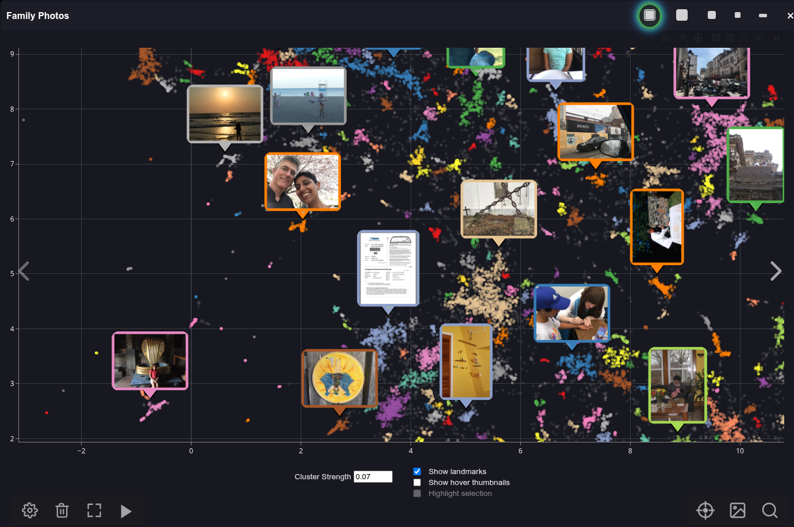

# PhotoMapAI

Rediscover your photo collection!

PhotoMapAI is a fast, modern image browser and search tool for large photo collections. It uses the CLIP computer vision model to enable text and image-based search, image clustering, and interactive slideshows with a responsive web interface. Its unique feature is a "semantic map" that clusters and visualizes your images by their content. Browse the semantic map to find and explore thematically-related groups of photos, or use text and/or image similarity search to find specific people, places, events, styles and themes.

<div class="try-demo-container">
 <span>Try it out here:</span>
   <a href="https://photomap.4crabs.org" target="_new">
      
   </a>
</div>



---

## Features

- Fast browsing of large image collections
- All images are local to your computer; nothing goes out to the internet
- AI-based text and image similarity search
- Thematic image clustering and visualization
- Flexible album management
- Responsive UI for desktop and mobile
- Support for wide range of image formats, including Apple's HEIC
- Extensible backend (FastAPI)

## The Semantic Map

PhotoMapAI's unique feature is its ability to identify thematically similar images and automatically cluster them, creating a "semantic map":


In this map, each image in the photo collection is represented as a dot. The colors distinguish different clusters of related images. You can zoom in and out of the map and pan around it. Hover the mouse over a dot in order to see a preview thumbnail of its image, or click on a cluster to view its contents at full resolution.

You can move the semantic map around, shrink it down in size, or hide it altogether. As you browse your photo collection, a yellow dot marker will highlight the location of the current image in the map.

## Text and Image Similarity Search

PhotoMapAI lets you search your collection by similarity to another image, by text, or by a combination of image and text as shown below:


You can start an image similarity search by uploading a local image file, dragging an image from a web browser window or file browser, or by selecting an existing image from your collection. There's also a "Text to Avoid" field, which can be used to disfavor certain image content.

## Photo Metadata Display

When viewing a photo in full-screen mode, you can pop out a little drawer to show its metadata, including the GPS location (if available), and the camera/phone settings:


### InvokeAI Metadata Support

If you are a user of the [InvokeAI](https://github.com/invoke-ai/InvokeAI) text-to-image generation tool, you can get quick access to the key settings used to generate the image, including the prompts, model and LoRAs in use, and the input images used for IPAdapters, ControlNets and the img2img raster layer. You can also display the full generation metadata in native JSON format and copy it to the clipboard.


## Other Features

PhotoMapAI supports most of the other features you would expect, including support for multiple separate photo albums, the ability to browse photos chronologically, an uncluttered fullscreen mode, and of course a configurable slideshow mode that can show images sequentially or shuffled.

---

## Quick Start

Here are instructions for installation on [Windows](#windows), [Linux/Mac](#linux-mac), [From the Python repo](#python-repository), and [Docker](#docker-install)

### Windows

#### 1. Download and unpack the source code

Download the PhotoMapAI source code as a .zip file from the latest stable Releases page. For development versions, use the "Download ZIP" link in the green "Code" button near the top of the GitHub PhotoMapAI home page.

Choose a convenient location in your home folder and unzip the file to create a new folder named `PhotoMapAI`.

#### 2. Run the installer script

Navigate to the unpacked `PhotoMapAI` folder, find the `INSTALL` folder, and double-click the `install_windows` script file. The system will check that Python and other requirements are installed, download the necessary library files, and create a .bat script named `start_photomap`.

#### 3. Start the server

Double-click `start_photomap.bat` to launch the server. You should see a few startup messages, followed by the URL for the running server.

#### 4. **Open your browser:**

Navigate to `http://localhost:8050` and follow the prompts to create and populate your first album.

---

### Linux & Mac

#### 1. Download and unpack the source code

Download the PhotoMapAI source code as a .zip file from the latest stable Releases page. For development versions, use the "Download ZIP" link in the green "Code" button near the top of the GitHub PhotoMapAI home page.

Choose a convenient location in your home directory and unzip the file to create a new folder named `PhotoMapAI`.

#### 2. Run the installer script

Navigate to the `PhotoMapAI` folder and launch the `install_linux_mac` shell script file. The script will check that Python and other requirements are installed, download the necessary library files, and create a launcher script named `start_photomap` on your desktop.

#### 3. Start the server

Double click `start_photomap` to launch the server. You will see a few startup messages followed by the URL for the running server.

#### 4. **Open your browser:**

Navigate to `http://localhost:8050` and follow the prompts to create and populate your first album.

---


### Python Repository

If you are familiar with installing Python packages from the PyPi repo, here is a quick four line recipe:

```bash
pip -mvenv photomap --prompt photomap
source photomap/bin/activate
pip install photomapai
start_photomap
```

After the startup messages, point your browser to http://localhost:8050 and follow the prompts.

---

### Docker Install

If you have Docker installed on your system, here is a one-liner to get PhotoMapAI up and running:

```bash
docker -p 8050:8050 -v /path/to/a/picture_folder:/Pictures lstein/photomapai:latest
```
Change `/path/to/a/picture_folder` to a path on your desktop that contains the images/photos you wish to add to an album. After the startup messages, point your browser to http://localhost:8050 and follow the prompts. Your images will be found in the container directory `/Pictures`.

---

### Executable Install

As of version 0.9.4, there is also an option to install a prebuilt executable package. This package does not require you to install Python, CUDA, or any other PhotoMapAI dependencies. However, the executable is not yet code-signed, meaning that Windows and Mac users will have to bypass code safety checks.

Go to the latest [release page](https://github.com/lstein/PhotoMapAI/releases) and look under **assets**. There you will find the following files, where X.X.X is replaced by the current released version number:

| Name                              | Platform            | GPU Acceleration |
|-----------------------------------|---------------------|--------------|
| photomap-linux-x64-cpu-vX.X.X.zip | Linux | none |
| photomap-linux-x64-cu129-vX.X.X.zip | Linux | CUDA 12.9 |
| photomap-macos-x64-cpu-vX.X.X.zip | Macintosh | built-in acceleration|
| photomap-windows-x64-cpu-vX.X.X.zip | Windows | none|
| photomap-windows-x64-cu129-vX.X.X.zip | Windows | CUDA 12.9|

If you have an Nvidia card and any of the CUDA 12.X libraries installed, you can take advantage of accelerated image indexing by choosing one of the `cu129` packages. Download the zip file for your platform and unpack it. Then follow these instructions to bypass the operating system's code-checking:

#### Mac

Using the command-line terminal, navigate to the unpacked folder `photomap-macos-x64-cpu-vX.X.X` and run this command:

```bash
xattr -d com.apple.quarantine ./photomap-macos-x64-cpu-vX.X.X`
```
(Use the actual version number, not X.X.X). This step only has to be done once.

Now you can double-click on the package and the PhotoMapAI server will launch in a terminal window after a brief delay.

#### Windows

After unpacking, navigate into the folder and double-click on `photomap.exe`. You will be warned that you are trying to run untrusted code. Click on the `More info` link, and choose `Run anyway`. After a short delay, a new terminal window will open up with the output from the PhotoMapAI server.

You'll need to override the untrusted code check each time you launch PhotoMapAI. 

#### Linux

Using the terminal/command-line shell, navigate to the unpacked folder and run `./photomap`. No trusted code workarounds are needed. If you prefer to double-click an icon, there is a `run_photomap.sh` script in the folder that will launch a terminal for you and run PhotoMapAI inside it.

---

## Detailed Guides

- [Installation](installation.md)
- [User Guide](user-guide/basic-usage.md)
- [Configuration](user-guide/configuration.md)
- [Developer Guide](developer/architecture.md)
- [Troubleshooting](troubleshooting.md)
