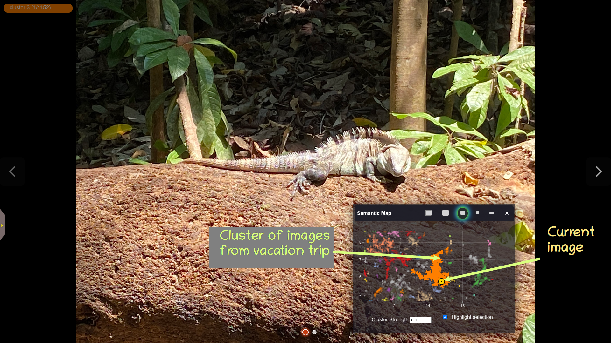
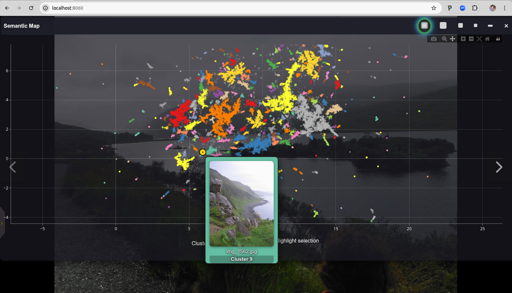
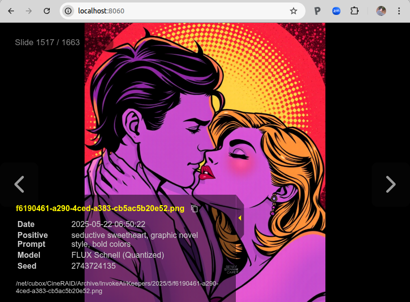

# PhotoMap

Rediscover your photo collection!

PhotoMap is a fast, modern image browser and search tool for large photo collections. It supports text and image-based search, semantic clustering, and interactive slideshows with a responsive web interface. Its unique feature is a "semantic map" that clusters and visualizes your images by their content. Browse the semantic map to find and explore thematically-related groups of photos, or use text and/or image similarity search to find specific people, places, events and themes.

## Features
- Fast browsing of large image collections
- AI-based text and image similarity search
- Thematic image clustering and visualization
- Flexible album management
- Responsive UI for desktop and mobile
- Extensible backend (FastAPI)

## The Semantic Map

PhotoMap's unique feature is its ability to identify thematically similar images and automatically cluster them, creating a "semantic map":

In this map, each image in the photo collection is represented as a dot. The colors distinguish different clusters of related images. You can zoom in and out of the map and pan around it. Hover the mouse over a dot in order to see a preview thumbnail of its image, or click on a cluster to view its contents at full resolution.

You can move the semantic map around, shrink it down in size, or hide it altogether. As you browser your photo collection, a yellow dot marker will highlight the location of the current image in the map.

## Text and Image Similarity Search

PhotoMap lets you search your collection by similarity to another image, by text, or by a combination of image and text as shown below:

You can start an image similarity search by uploading a local image file, dragging an image from a web browser window or file browser, or by selecting an existing image from your collection. There's also a "Text to Avoid" field, which can be used to disfavor certain image content.

## Support for Image Metadata

When viewing a photo in full-screen mode, you can pop out a little drawer to show its metadata, including the GPS location (if available), and the phone settings:

If you are a user of the [InvokeAI](https://github.com/invoke-ai/InvokeAI) text-to-image generation tool, you can get quick access to the key settings used to generate the image.

## Other Features

PhotoMap supports most of the other features you would expect, including support for multiple separate photo albums, the ability to browse photos chronologically, an uncluttered fullscreen mode, and of course a configurable slideshow mode that can show images sequentially or shuffled.

---

## Quick Start

### Linux / Mac

1. **Create a virtual environment for the app:**

        python3 -m venv ~/photomap     (or choose your own installation location)
        source ~/photomap/bin/activate

2. **Install the app:**  
   From within the code repository (the one containing README.md)

        pip install .

3. **Run the app:**

        ~/photomap/bin/start_photomap

4. **Open your browser:**  
   Navigate to `http://localhost:8050`.

---

### Windows

Open a PowerShell window and type these commands in.

1. **Launch the Windows installer **
    - Navigate to the photomap source code folder and launch `installation/install_windows`.
    - If you are prompted to install python, please do so and try again. 
    - When prompted, select an install location for photomap. This will create a launcher script in the selected location named `start_photomap.bat`

3. **Run the app:**
    Launch `start_photomap.bat`.

4. **Open your browser:**  
   Navigate to `http://localhost:8050`

## Detailed Guides
- [Installation](installation.md)
- [User Guide](user-guide/basic-usage.md)
- [Configuration](configuration.md)
- [Developer Guide](developer/architecture.md)
- [Troubleshooting](troubleshooting.md)

