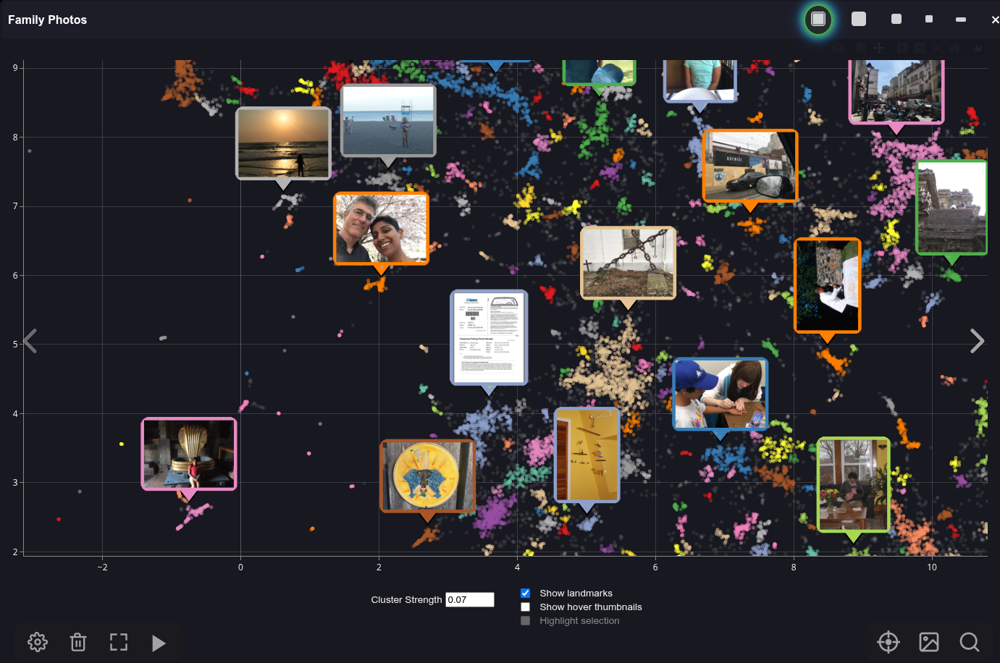
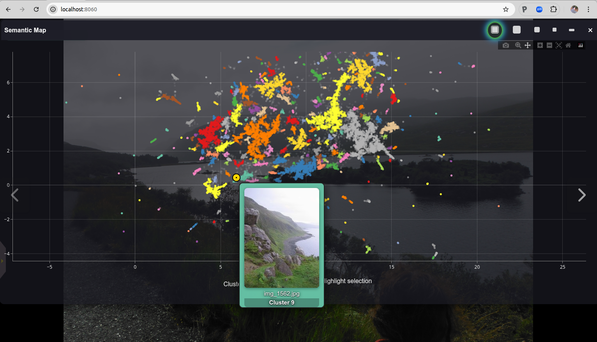
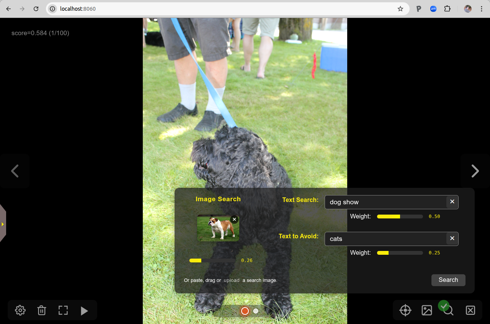
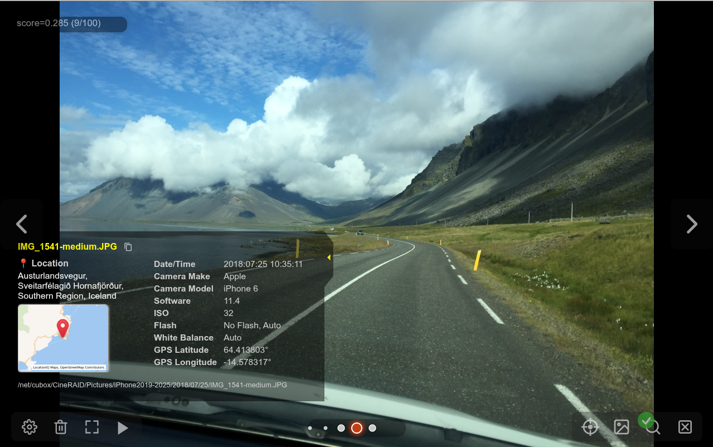
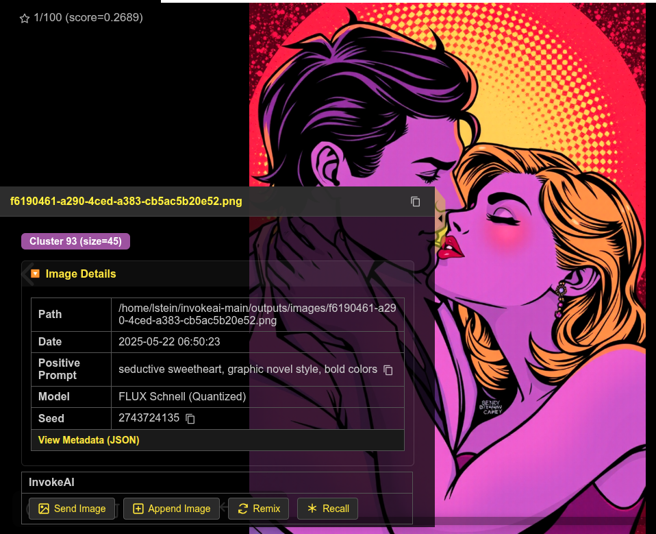

# PhotoMapAI

Rediscover your photo collection!

PhotoMapAI is a fast, modern image browser and search tool for large
photo collections. It uses the CLIP computer vision model to enable
text and image-based search, image clustering, and interactive
slideshows with a responsive web interface. Its unique feature is a
"semantic map" that clusters and visualizes your images by their
content. Browse the semantic map to find and explore
thematically-related groups of photos, or use text and/or image
similarity search to find specific people, places, events, styles and
themes.

<div class="try-demo-container">
 <span>Try it out here:</span>
   <a href="https://photomap.4crabs.org" target="_new">
      
   </a>
</div>



---

## Features

- Fast browsing of large image collections
- All images are local to your computer; nothing goes out to the internet
- AI-based text and image similarity search
- Thematic image clustering and visualization
- Flexible album management
- Responsive UI for desktop and mobile
- Support for wide range of image formats, including Apple's HEIC
- Integration with the InvokeAI image generation app.
- Extensible backend (FastAPI)

## The Semantic Map

PhotoMapAI's unique feature is its ability to identify thematically similar images and automatically cluster them, creating a "semantic map":



In this map, each image in the photo collection is represented as a dot. The colors distinguish different clusters of related images. You can zoom in and out of the map and pan around it. Hover the mouse over a dot in order to see a preview thumbnail of its image, or click on a cluster to view its contents at full resolution.

You can move the semantic map around, shrink it down in size, or hide it altogether. As you browse your photo collection, a yellow dot marker will highlight the location of the current image in the map.

## Text and Image Similarity Search

PhotoMapAI lets you search your collection by similarity to another image, by text, or by a combination of image and text as shown below:



You can start an image similarity search by uploading a local image file, dragging an image from a web browser window or file browser, or by selecting an existing image from your collection. There's also a "Text to Avoid" field, which can be used to disfavor certain image content.

## Photo Metadata Display

When viewing a photo in full-screen mode, you can pop out a little drawer to show its metadata, including the GPS location (if available), and the camera/phone settings:



### InvokeAI Metadata Support

If you are a user of the [InvokeAI](https://github.com/invoke-ai/InvokeAI) text-to-image generation tool, you can get quick access to the key settings used to generate the image, including the prompts, model and LoRAs in use, and the input images used for IPAdapters, ControlNets and the img2img raster layer. You can also display the full generation metadata in native JSON format and copy it to the clipboard.



## Other Features

PhotoMapAI supports most of the other features you would expect, including support for multiple separate photo albums, the ability to browse photos chronologically, an uncluttered fullscreen mode, and of course a configurable slideshow mode that can show images sequentially or shuffled.

---

## Quick Start

The easiest way to install PhotoMapAI is the native installer for your platform. **You don't need Python, CUDA, or anything else first** — the installer sets everything up on first launch. Download the file for your system from the latest [Releases page](https://github.com/lstein/PhotoMapAI/releases) (under **Assets**), where `X.X.X` is the current version:

| Platform | Download | Install |
|----------|----------|---------|
| **macOS** | `PhotoMapAI-X.X.X.dmg` | Open the `.dmg`, drag **PhotoMapAI** to **Applications** |
| **Windows** | `PhotoMapAI-X.X.X-setup.exe` | Run the installer (no admin rights needed) |
| **Linux** | `PhotoMapAI-X.X.X-x86_64.AppImage` | `chmod +x` it and double-click, or run from a terminal |

The **first** launch downloads a private copy of Python and the AI libraries (a multi-gigabyte, one-time download that takes a few minutes; a console window shows progress). When it finishes, the server starts and your browser opens automatically to create your first album. Later launches start in seconds. An NVIDIA GPU is detected and used automatically, as is Apple Silicon acceleration.

See the [Installation guide](installation.md) for PyPI, Docker, source, GPU overrides, and uninstall details.

### Install from the command line

If you already have Python 3.10–3.14:

```bash
uv tool install photomapai --python 3.12 --python-preference only-managed --torch-backend auto
start_photomap
# (or simply: pip install photomapai && start_photomap)
```

After the startup messages your browser opens to http://localhost:8050 automatically.

---

## Detailed Guides

- [Installation](installation.md)
- [User Guide](user-guide/basic-usage.md)
- [Configuration](user-guide/configuration.md)
- [Developer Guide](developer/architecture.md)
- [Troubleshooting](troubleshooting.md)
