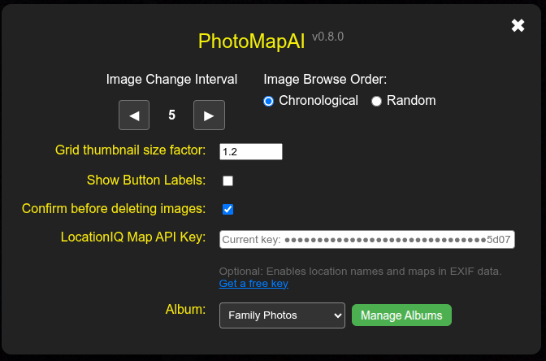

# Managing Albums

PhotoMapAI allows you to organize your photos and other images into a series of albums. Each album draws its images from one or more folders of images, and manages independent search indexes and semantic maps. Albums may also overlap by having some image paths in common -- with some restrictions.

## Adding Albums

Bring up the Album Manager by clicking on the **Settings** gear icon and then the green Manage Albums> button.

The Album Management dialogue provides you with controls for creating new albums, editing existing ones, deleting unwanted albums, and bringing an album's contents up to date after you've added or removed image file from its folder paths.

  
  

To add an album, press the green Add Album button. This will add a new section to the dialogue window that prompts you to enter the following fields:

- **Album Key** - This is a short mnemonic text that is used to uniquely identify the album. You can add it to PhotoMapAI's URL in order to go directly to the album of your choice, so it is best to avoid spaces and symbols. Once the key is assigned, you can't change it.
- **Display Name** - This is the name of the album that will be displayed in the settings Album popup menu and the browser tab window title.
- **Description** (optional) - A description of the album.
- **Image Paths** - One or more filesystem paths to the folders that contain image files to incorporate into the album.

You are free to organize your image files in any way you wish. You can dump them into a single big folder, or organize them into multiple nested subfolders. During indexing, PhotoMapAI will traverse the folder structure and identify all image files of type JPEG, PNG, TIFF, HEIF, and HEIC.

## Indexing Albums

For fast search and retrieval, PhotoMapAI indexes all the image files it finds and stores them in a compact set of indexes. Indexing begins automatically when you first add an album, and will continue in the background even if you navigate away from the Album Manager, or even close the browser.

The time it takes to index depends on how many image files you have, their size, the speed of the disk media, and the availability of a GPU. On a typical Windows machine with an NVidia graphics card, it takes ~2 hours to index 80,000 images located on a network mounted disk. Expect the speed to be noticeably faster on a collection of images located on a local solid-state disk, and much slower (about 10X) on a machine that lacks GPU acceleration.

During indexing, PhotoMapAI will display its progress in three phases. First, it traverses the directory(ies) specified in the album configuration to identify and count image files. During this time PhotoMapAI displays the number of images it has found, but is unable to provide a time or %completion estimate. Second, it runs each image through a machine learning (AI) model to extract high-dimensional semantic information from the image (technically an "embedding"). During this phase, which is usually the longest in duration, PhotoMapAI will display its progress towards completion and an ETA. Lastly, PhotoMapAI generates the cluster map for all the image embeddings it has generated (technically, this is called a "umap"). The umap creation phase typically takes less than a minute and does not benefit from GPU acceleration.

When the indexing process is done, you will find the generated indexes stored in a folder named "photomap_index" located in the first image folder path of the album. Try not to remove or rename this folder. The indexes are relatively small. A folder of 80,000 images that totals 85 GB yields an index that is 300 MB in size.

When you add or remove image files from an album's image directory, you will need to reindex the album. Navigate to the album in the Album Manager list and press the blue Update Index button. The update operation will only reindex the files that have been added or removed and will be much faster than the first comprehensive indexing operation.

## Editing an Album

To make changes to an album's definition, including changing its display name, description or paths, click the orange Edit button next to the album's entry in the Album Manager dialogue. Note that you cannot change the album key once the Album is initialized.

## Deleting an Album

To delete an album, click on the red Delete button next to the album entry. This will delete the configuration for the album, but doesn't change the underlying image files or the PhotoMapAI indexes. In particular, if you now add a new album that contains the same image path(s) as the previously-deleted album, the leftover indexes will be recognized and valid and you will not need to reindex.

## Selecting an Album by URL

You can easily construct a URL that will directly select an album of your choice. Use the format:

   http://localhost:8050?album=<album_key>
   
Where `album_key` is the key (not the name) for the album you wish to load.
