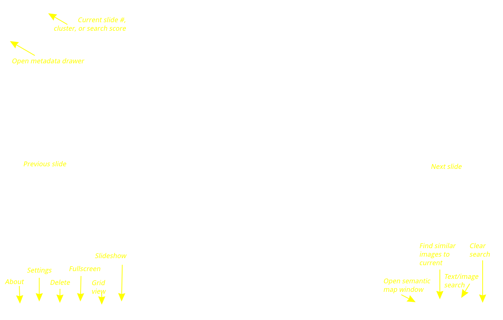
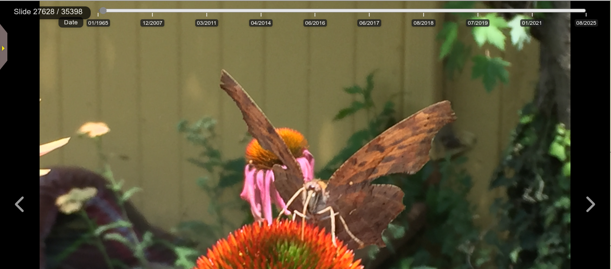

# Basic Usage

PhotoMapAI is organized into a series of photo albums. Each album is a collection of images on the local machine or a shared drive.

## Creating an album

The first time you launch PhotoMapAI it will prompt you to create an album with the screen shown below.

Enter a short lowercase key for the album, such as "family", a longer descriptive name such as "Family Photos 2025", and optionally a description of the album. (The key can be used in URLs if you wish to share a particular album in a text or email message as [described here](albums.md#selecting-an-album-by-url)).

You'll now need to tell the album where its photos are stored. Enter one or more filesystem paths in the text field at the bottom named "Image Paths". Photos can be stored in a single large folder, or stored in multiple nestered folders. They can reside on the local disk or on a shared disk. If you wish, you can point the album to multiple folders, and their contents will be combined into a single album.

PhotoMapAI supports photos in JPEG, PNG, TIFF, GIF, and HEIC/HEIF formats.

The screenshot below shows the dialogue after populating it on a Linux or MacOS system. On Windows systems use the usual `C:\path\to\directory` notation.

Once the album is set up to your liking, press the `Add Album` button at the bottom left and indexing will start:

Indexing can take some time. On a system equipped with an NVidia GPU, indexing a collection of ~50,000 images will take about two hours. On a system with CPU only, the process will take overnight. Mac users with hardware accelerated M1/2/3 chips will see performance somewhere in between the two. It is suggested to start with a small collection of photos (1000-2000 images) for your first album in order to test PhotoMapAI and get comfortable with its features.

Once indexing is complete, the dialogue will close and you can start exploring your collection.

For more information on adding and modifying albums see [Albums](albums.md).

## The Semantic Map

When you open an album for the first time, it will show the [Semantic Map](semantic-map.md) view, a scatterplot of all the photos in your album, clustered and colored by similarity.

The initial view shows the entire collection, with a yellow target (far left side of the screenshot) marking the current photo on display. Use the mouse and scrollwheel to zoom in and out of the map and pan around. If you zoom in enough, you will see individual dots for each photo. The largest clusters are labeled with landmark images shown in the screenshot above as map markers pointing to major clusters. Hover the mouse over areas of interest to see larger thumbnail previews of the corresponding images. You can control whether landmarks and/or hover thumbnails are displayed by selecting those options in the checkboxes at the bottom of the screen. 

Click on a dot to load that photo into the [album browsing display](#the-album-browsing-display). This will also highlight the cluster that you clicked in and load the contents of the cluster into the search results. You can then use the navigation buttons or the [grid view](#viewing-a-thumbnail-grid) to scroll through the images in the selected cluster.

If you don't see anything, or if the colors are very faint, this means that there were insufficient images in the album to cluster well. You can fix this by increasing the cluster strength. Go to the *Cluster Strength* field and increase its value until you are satisfied with the cluster number and size.

If you hover over the top of the map, additional navigation controls appear for zooming in and out, panning, resetting to the default scale, and downloading the map as a PNG image.

You can control the size and position of the semantic map. You can have it appear in fullscreen mode that covers the full size image display beneath it, or you can set it to be a semi-transparent window that floats on top of the full size image. See [Semantic Map](./semantic-map.md) for more details.

You can completely close the semantic map at any time by clicking its close box or the *Target* (⊙) icon at the bottom of the screen (see the screenshot below). To reopen the map, click the *Target* icon again.

  
  

## The Album Browsing Display

If you click on an image in the semantic map, or just close the window, you will see the album browsing display shown below. Hover over the screenshot to see the key to the various buttons and controls for album browsing:

  
  

Going from left to right:

- The *About* button shows the current version of the software and links to its  home page.
_ The *Previous slide* and *Next slide* buttons advance the images in the album or current search.
- The *Gear* button opens up a dialogue that lets you adjust the behavior and appearance of PhotoMapAI.
- The *Trash* icon permanently deletes the current photo from the album and removes the disk file (after confirmation).
- The *Fullscreen* button puts PhotoMapAI into fullscreen mode and hides most of the control elements.
- The *Grid* icon toggles between showing one image at a time to showing a screen of thumbnails.
- The *Play/Pause* button starts and stops a slideshow in which the photos autoadvance after a user-adjustable interval.
- The *Target* icon opens and closes the [semantic map](semantic-map.md).
- The *Landscape* icon initiates a search for images similar to the one currently displayed.
- The *Magnifier* button opens up a search dialogue that lets you search by image similarity and/or a text description of image content.
- The "Clear search* button clears any search that is currently active and returns to album browsing mode.

Finally, the yellow tab with the black arrow on the left margin of the window opens a drawer that displays the image's EXIF date, including the date the photo was taken, GPS information (if available), and camera information. Once you open the drawer up, you can drag it around by clicking on any of its edges. Click the black arrow again to return it to its home location and close it.

### Jumping Forward and Back

Hover the mouse near the top of the window to reveal a slider control that will let you seek forward and backward among the images. If no search is active, the slider shows the images sorted by their date. If an image or text similarity search is active, the slider changes to indicate the match score (higher numbers are better matches). If a cluster was selected with the semantic map, then the slider changes to indicate the slide numbers within the cluster.

You can navigate through your album, enter and exit fullscreen, and start and stop the slideshow with a variety of keystrokes and gestures on touch-enabled devices. See [Keyboard Shortcuts](keyboard-shortcuts.md) for details.

## Viewing a Thumbnail Grid

At any time you can click on the *Grid* icon to shift from single-slide mode to grid mode:

In grid mode, the arrow buttons move forward and back one screen's worth of thumbnails. Click on a thumbnail to select its image. When selected, the image's metadata will be displayed in the metadata drawer, and the semantic map will update to show the position of the current image. You may also advance the grid using the slider control that appears when you hover near the top of the window. 

## Changing Settings

The Gear icon opens the settings dialogue, which allows you to adjust the appearance and behavior of PhotoMapAI:

- **Image Change Interval** -- When the slideshow is running, this controls how long each image will be displayed, in seconds.
- **Image Browse Order** -- When the slideshow is running, or when you are browsing the album without an active search, this controls the order in which photos are displayed. "Random" will present the images in shuffled order, while "Chronological" will show them in order from oldest to newest.
- **Show Button Labels** -- Disabling this checkbox allows you to turn off the labels on the row of clickable icons at the bottom of the screen for a more minimalist experience.
- **Confirm before deleting images** -- Disabling this checkbox stops the Trash Can icon from asking for confirmation before permanently deleting the current image from disk.
- **LocationIQ Map API Key** -- This optional API key lets PhotoMapAI display thumbnail maps and named locations for photos that contain GPS geolocation information. If you wish to enable this feature, get a key for free from [LocationIQ](http://locationiq.com/) and paste it into the field. If not present, PhotoMapAI will display the longitude and latitude of the photo, but not the map or place name.
- **Album** -- This pulldown menu lists all the albums you have configured and allows you to switch among them. Note that when you switch albums, the settings dialogue will close immediately and the window will display the first photo from the selected albums.
- **Manage Albums** -- This green button will open the [Album Manager](albums.md), where you can create, edit and delete albums.
