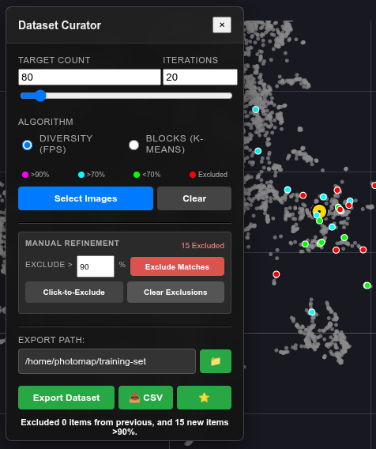

# Dataset Curation

The **Dataset Curator** is a powerful feature in PhotoMapAI designed to help you select a diverse or representative subset of images from a large album. This is particularly useful for creating training datasets for LoRA (Low-Rank Adaptation) image generation/classification models or simply reducing the redundancy in a large collection of images.

## Accessing the Curator

1.  Open an album in the grid or semantic map view.
2.  Click the **Favorites** menu button (⭐) in the bottom-right of the window.
3.  Select **Curate** (pencil icon 📝) from the dropdown menu.

The curator panel will appear and can be repositioned by dragging its title bar.

## Selection Algorithms

The curator offers two distinct algorithms for selecting images, selectable via radio buttons:

### Diversity (FPS)
**Farthest Point Sampling** selects images that are as different from each other as possible.

* **Best for:** Ensuring your dataset covers the widest possible range of visual concepts, lighting conditions, and angles. Use it for:

    * **High Quality Data:** FPS seeks outliers. In a "dirty" dataset, outliers are often blurry or broken images. In a "clean" dataset, outliers are your rare concepts (side profiles, dramatic lighting).

    * **Unbalanced Data:** If you have 50 full-body images and 10 close-ups, FPS will prioritize the close-ups to ensure the AI learns the rare concept, rather than just the common one.

* **How it works:** It starts with a random image (or your excluded selection) and iteratively picks the image whose feature vector is farthest from the current set.

### Blocks (K-Means)
**K-Means Clustering** groups images into clusters and picks a representative image from each cluster.

* **Best for:** Reducing redundancy while maintaining the overall distribution of the dataset (Representative Sampling). Use it for:

    * **Balanced Distribution:** If you have 50 full-body images and 10 close-ups, K-Means will select roughly 5 full-body images for every 1 close-up, preserving the original ratios of your dataset.

* **How it works:** It divides your images into N clusters (where N is your target count) and selects the image closest to the mathematical center of each cluster.

## Workflow

1.  **Setup your UI**: 
    - When the curator panel opens, the UMAP visualization automatically switches to grey mode - all points turn grey to make the colored selection overlays more visible.
    - Unclustered points (normally very faint) increase in opacity to match clustered points, providing a uniform background.
    - It is recommended to turn off "Show landmarks" and "Show hover thumbnails" in the UMAP controls for a cleaner view.
2.  **Set Target Count**: Choose how many images you want in your final set (e.g., 50, 150).
3.  **Set Iterations**: 
    -   Algorithms like FPS can be sensitive to the starting point. Running multiple iterations (Monte Carlo simulation) helps identify the "consensus" selections—images that are statistically important regardless of the random start.
    -   **Recommendation:** Set to 20 iterations for analysis.
4.  **Run Selection**: Click **Select Images** (circled button) to select a diverse distribution of images.
    -   A yellow-and-white progress bar appears below the title, showing the progress of the selected algorithm.

### Stability Heatmap
The results are displayed as a Stability Heatmap:

*   🟣 **Magenta**: Core Outliers (Selected in >90% of runs). These are your most mathematically unique images.
*   🔵 **Cyan**: Stable (Selected in >70% of runs).
*   🟢 **Green**: Variable (Selected in <70% of runs). Edge cases that usually fill gaps.

If you now open the grid view (by hiding or minimizing the semantic map window) you will see the selected images at full brightness, while others will be dimmed. Press the "Clear" button on the curator panel or the "X" button on the bottom right of the main window, in order to clear the search and return to the normal view.

## Refinement & Exclusion
You can manually refine the selection by excluding images. Excluding an image removes it from calculations and exports. This is commonly needed when your collection contains "garbage", such as blank or blurry images, that appear to the algorithm as interesting outliers.

This allows for a "Drill Down" workflow:

1.  Run the analysis.

2.  If the top results (🟣 **Magenta**) are garbage, exclude them.

3.  Run **Select Images** again. The algorithm will be forced to ignore the excluded images and find the next best candidates.

    -   **Click-to-Exclude**: Toggle this mode and click images in the grid (or UMAP) to exclude/include them. Excluded images appear as solid 🔴 **Red** circles. (See image below. Yellow arrows added for emphasis.)
    -   **Exclude Matches**: Bulk-exclude all images that meet a certain frequency threshold (e.g., >90%).
    -   **Clear Exclusions**: Clear all exclusions in order to start over.

## Recommended Workflows

### Scenario A: Cleaning a Dataset (Removing Garbage)
1.  Set **Target Count** to 20. Set **Iterations** to 20.
2.  Click **Select Training Set** (FPS).
3.  Look at the **Magenta** (>90%) results. Since FPS hunts for outliers, these will be your "weirdest" images.
4.  If they are broken/blurry, click **Exclude Matches** (or exclude manually).
5.  Repeat until the selection shows only high-quality images.
    *   *Note: Do not export yet. You are just identifying what to ignore.*

### Scenario B: Generating a Training Set
1.  Clear any previous selections (keep exclusions if you identified garbage in Scenario A).
2.  Set **Target Count** to your desired training size (e.g., 150).
3.  Set **Iterations** to 20.
4.  Click **Select Training Set**.
5.  Review the selection. If you see images you don't want in your training set, **Exclude** them and run **Select Images** again to replace them with fresh alternatives.
6.  Repeat as needed.

## Exporting

Once you are satisfied with your selection:

1.  Click the folder icon (📁) next to the **Export Path** field to browse for a destination folder.
    - The selected path is saved in your browser and persists across sessions.
    
2.  Click **Export Dataset**.

3.  The system will copy the selected images (and associated text files, see below) to the folder. The original images will remain in place.

4.  Click the **CSV** button to export a tab-delimited inventory of the included and excluded files.

At any point, you may also click the **Set Favorites** button (⭐) to replace your current favorites with the curated selection. This allows you to show and hide the selection conveniently using the **Favorites** menu, as well as to move the selected images to a new folder while preserving them in the index.

## Notes

*   *Text files are also exported! If you have 0001.jpg and 0001.txt in the album, they will be exported together. This is useful for maintaining external text annotations of images.
*   *Excluded (Red) images are NOT exported.
*   *Filename collisions (e.g. apple/01.jpg vs orange/01.jpg) are automatically handled by renaming.

## For More Information

Contact */u/AcadiaVivid* on reddit or *NMWave* on github for assistance and information.
