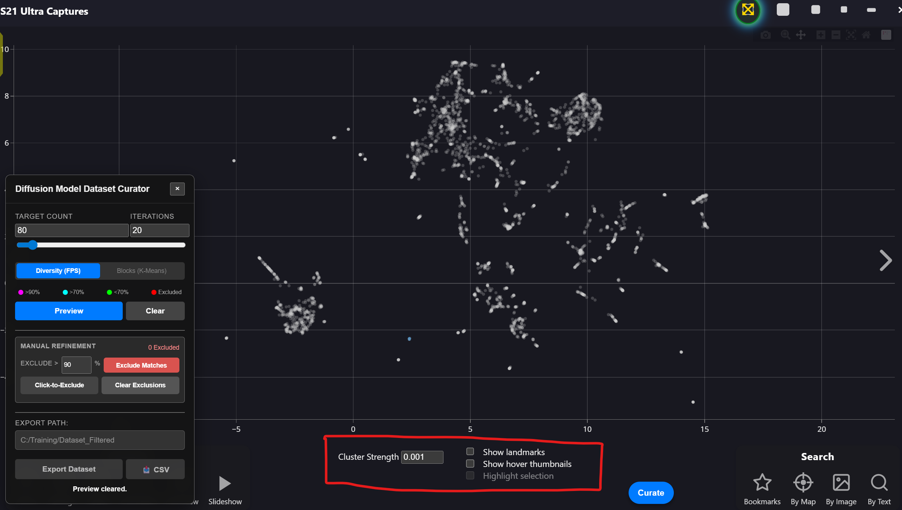
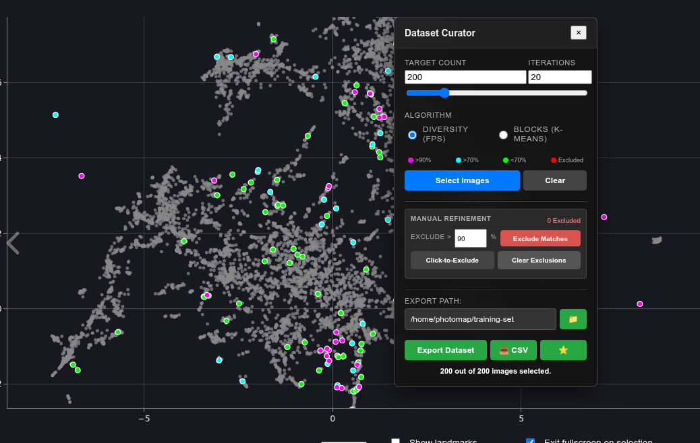
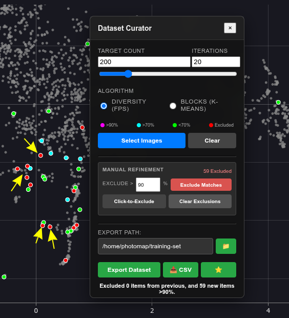
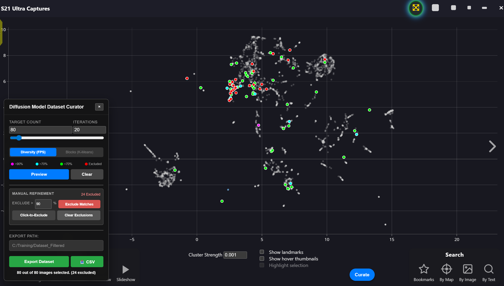

# Image Generation Model Dataset Curator

The Dataset Curator is a powerful feature in PhotoMapAI designed to help you select a diverse or representative subset of images from a large album. This is particularly useful for creating training datasets for LoRA (Low-Rank Adaptation) models or simply thinning out a large collection using CLIP embeddings as the driver.

## Accessing the Curator

1.  Open an album in the grid view.
2.  Click the **Favorites** menu button (⭐) in the top-right corner.
3.  Select **Curate** (pencil icon 📝) from the dropdown menu.

The curator panel will appear and can be repositioned by dragging its title bar.

## Selection Algorithms

The curator offers two distinct algorithms for selecting images, selectable via radio buttons:

### Diversity (FPS)
**Farthest Point Sampling** selects images that are as different from each other as possible.
-   **Best for:** Ensuring your dataset covers the widest possible range of visual concepts, lighting conditions, and angles.
-   **When to use:**
    -   **High Quality Data:** FPS seeks outliers. In a "dirty" dataset, outliers are often blurry or broken images. In a "clean" dataset, outliers are your rare concepts (side profiles, dramatic lighting).
    -   **Unbalanced Data:** If you have 50 full-body images and 10 close-ups, FPS will prioritize the close-ups to ensure the AI learns the rare concept, rather than just the common one.
-   **How it works:** It starts with a random image (or your excluded selection) and iteratively picks the image whose feature vector is farthest from the current set.

### Blocks (K-Means)
**K-Means Clustering** groups images into clusters and picks a representative image from each cluster.
-   **Best for:** Reducing redundancy while maintaining the overall distribution of the dataset (Representative Sampling).
-   **When to use:**
    -   **Balanced Distribution:** If you have 50 full-body images and 10 close-ups, K-Means will select roughly 5 full-body images for every 1 close-up, preserving the original ratios of your dataset.
-   **How it works:** It divides your images into N clusters (where N is your target count) and selects the image closest to the mathematical center of each cluster.

## Workflow
1.  **Setup your UI**: 
    - When the curator panel opens, the UMAP visualization automatically switches to grey mode - all points turn grey to make the colored selection overlays more visible.
    - Unclustered points (normally very faint) increase in opacity to match clustered points, providing a uniform background.
    - Recommend turning off "Show landmarks" and "Show hover thumbnails" in the UMAP controls for a cleaner view.
    - The UMAP checkboxes are arranged in two columns for easy access.

2.  **Set Target Count**: Choose how many images you want in your final set (e.g., 50, 150).
3.  **Set Iterations**: 
    -   Algorithms like FPS can be sensitive to the starting point. Running multiple iterations (Monte Carlo simulation) helps identify the "consensus" selections—images that are statistically important regardless of the random start.
    -   **Recommendation:** Set to 20 iterations for analysis.
4.  **Run Selection**: Click **Select Diverse Images** to run the simulation.
    -   A yellow-and-white progress bar appears below the title, showing real-time progress (e.g., "Iteration 5/20").
    -   The progress bar accurately reflects each iteration as it completes.

### Stability Heatmap
The results are displayed as a Stability Heatmap:
-   🟣 **Magenta**: Core Outliers (Selected in >90% of runs). These are your most mathematically unique images.
-   🔵 **Cyan**: Stable (Selected in >70% of runs).
-   🟢 **Green**: Variable (Selected in <70% of runs). Edge cases that usually fill gaps.

Unselected images will be dimmed. When you have an active curation selection, the "Exit Search" button appears, allowing you to clear the selection and return to normal view.

## Refinement & Exclusion
You can manually refine the selection by "Excluding" images. Excluding an image removes it from calculations and exports.

This allows for a "Drill Down" workflow:
1.  Run the analysis.
2.  If the top results (Magenta) are garbage (e.g., blurry images), Exclude them.
3.  Run Select Diverse Images again. The algorithm is forced to ignore the excluded images and find the next best candidates.

-   **Click-to-Exclude**: Toggle this mode and click images in the grid (or UMAP) to exclude/include them. Excluded images appear with a **Red Border**.
-   **Exclude Matches**: Bulk-exclude all images that meet a certain frequency threshold (e.g., >90%).
-   **Clear Exclusions**: Clear all exclusions and restart the analysis.

## Recommended Workflows

### Scenario A: Cleaning a Dataset (Removing Garbage)
1.  Set **Target Count** to 20. Set **Iterations** to 20.
2.  Click **Select Diverse Images** (FPS).
3.  Look at the **Magenta** (>90%) results. Since FPS hunts for outliers, these will be your "weirdest" images.
4.  If they are broken/blurry, click **Exclude Matches** (or exclude manually).
5.  Repeat until the selection shows only high-quality images.
    *   *Note: Do not export yet. You are just identifying what to ignore.*

### Scenario B: Generating a Training Set
1.  Clear any previous selections (keep exclusions if you identified garbage in Scenario A).
2.  Set **Target Count** to your desired training size (e.g., 150).
3.  Set **Iterations** to 20.
4.  Click **Select Diverse Images**.
5.  Review the selection. If you see images you don't want in your LoRA, **Exclude** them and run Select Diverse Images again to replace them with fresh alternatives.
6.  **Export Dataset**.

## Exporting

Once you are satisfied with your selection (Magenta/Cyan/Green images):
1.  Click the folder icon (📁) next to the **Export Path** field to browse for a destination folder.
    - The selected path is saved in your browser and persists across sessions.
    - The Export Dataset button remains disabled until a valid path is selected.
2.  Click **Export Dataset**.
3.  The system will copy the selected images (and associated text files) to the folder.
4.  Click the **CSV** button to export data on the included and excluded files.
5.  Click the **Set Favorites** button (⭐) to replace your current favorites with the curated selection.
    - The star button is disabled when there's no selection.
    - This provides quick access to your curated images for review.

*   *Note: Text files are also exported! If you have 0001.jpg and 0001.txt in the album, they will be exported together.*
*   *Note: Excluded (Red) images are NOT exported.*
*   *Note: Filename collisions (e.g. apple/01.jpg vs orange/01.jpg) are automatically handled by renaming.*

## Clearing Results
When you have an active curation selection, the "Exit Search" button becomes visible in the search panel. Click it to:
- Clear the curation selection
- Remove colored overlays from the UMAP
- Return the UMAP to normal cluster colors
- Hide the "Exit Search" button

## Visual Feedback
- **Panel Position**: The curator panel can be dragged by its title bar to any position on screen
- **UMAP Integration**: When the panel is open, the UMAP automatically adjusts:
  - All points turn grey for better contrast with selection colors
  - Unclustered points become fully visible (opacity 0.75)
  - The current image marker (yellow dot) remains visible
- **Progress Tracking**: Real-time iteration progress with accurate percentage display
- **Button States**: All action buttons (Export, CSV, Set Favorites) are intelligently enabled/disabled based on selection state

### Contact /u/AcadiaVivid on reddit or NMWave on github for more info on implementation.
