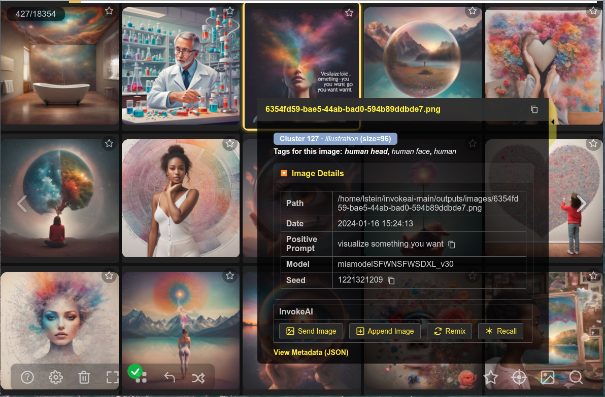
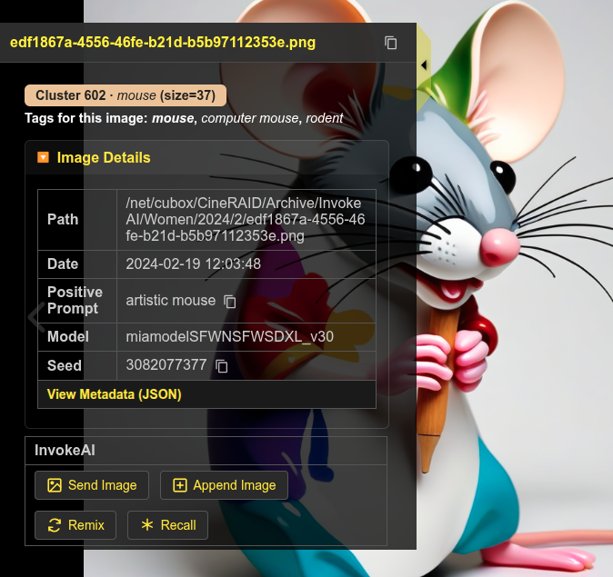
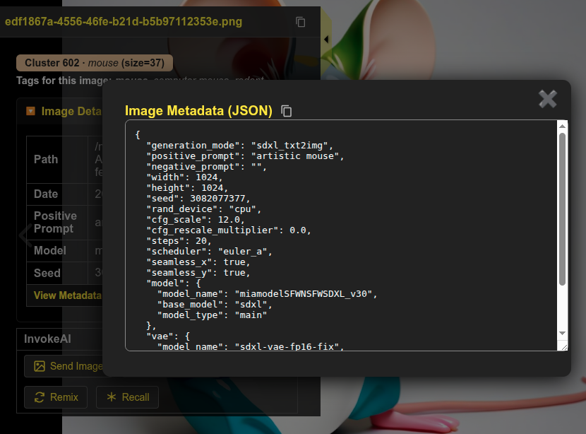
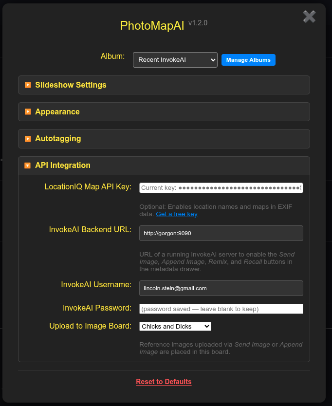
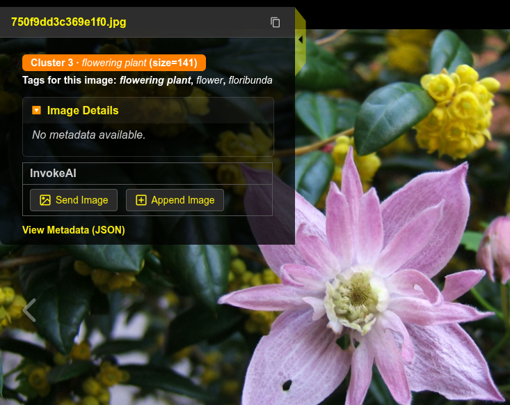

# InvokeAI Integration

PhotoMapAI works well as a browser for AI images generated by
[InvokeAI](https://invoke-ai.github.io/InvokeAI/), the popular
open-source generative-image application. When browsing a directory
containing InvokeAI images, PhotoMapAI gives you easy access to the
image's generation parameters, including the prompt, model and other
parameters. You can also connect PhotoMapAI to a running InvokeAI
backend to enable PhotoMapAI to send images back into InvokeAI for
further work.

## Background

InvokeAI is a free, locally-hosted text-to-image generator built
around Stable Diffusion and related models. You can download it from
the [InvokeAI project
page](https://github.com/invoke-ai/InvokeAI). PhotoMapAI does not
require InvokeAI to be installed — every feature described elsewhere
in the User Guide works on any folder of images — but if you do
generate images with InvokeAI, the integration described here lets you
index, search, and remix that gallery from the same interface.

## Creating an InvokeAI Album

You can point PhotoMapAI directly at InvokeAI's internal image storage
to create a comprehensive album of the contents of all InvokeAI's
image boards, or you can selectively download images from InvokeAI and
store them in an external directory for a curated experience.

### Creating a Comprehensive Album

InvokeAI stores every finished image under its **InvokeAI root**, in a
folder named `outputs/images/`. The location of the root depends on
how you installed InvokeAI:

- **Launcher / community edition (default)** — the launcher prompts
  you for the root directory the first time it runs and remembers your
  choice. On Windows it is typically `C:\Users\<you>\invokeai`; on
  macOS and Linux it is typically `~/invokeai`.

- **Manual installs** — whatever path you passed via `--root` or
  `INVOKEAI_ROOT`. You can confirm the path from the InvokeAI web UI
  under **Settings → Application**.

Once you know the root, point a new PhotoMapAI album at the `outputs/images/` subfolder:

1. Open **Settings → Manage Albums** and press Add Album.

2. Give the album a key (for example `invokeai`) and a display name
   (for example `InvokeAI Gallery`).

3. In **Image Folder(s)**, enter the full path to `<invokeai-root>/outputs/images`.

4. Save the album. PhotoMapAI will index every image it finds; see
   [Managing Albums](albums.md#indexing-albums) for what to expect
   during indexing.

!!! note
    PhotoMapAI does not watch the InvokeAI gallery for new
	files. Whenever you have generated a batch of images you want to
	browse or search, return to the Album Manager, select the album, and
	press the blue Update Index
	button. Only the new and removed files are processed, so the update is
	much faster than the initial indexing pass.

### Selectively Indexing InvokeAI Image Boards

When you index the entire InvokeAI internal images directory, the
resulting album will be a mixture of images from all InvokeAI boards,
including uploaded assets. For a more controlled experience, you can
selectively download InvokeAI image boards, save the images to an
external directory, and add that directory to your album.

1. Open InvokeAI in a browser.
2. Right click on a board you wish to add to PhotoMapAI.
3. Select "Download Board" to download the images as a zip file.
4. Unpack the zip file in a folder that PhotoMapAI has access to.
5. Create/add this folder to the PhotoMapAI album of your choice.

!!! note
    When you update a board, you will have to repeat this
    procedure. PhotoMapAI remembers which images were previously indexed
    and only indexes new images that it finds. Check back for a fuller
    integration of PhotoMapAI with Invoke's image boards that is in the
    planning phase.*
	
### Viewing InvokeAI Metadata

When an InvokeAI-generated image is selected in the PhotoMap browser,
a summary of its metadata will appear in the metadata drawer (see
below).  The drawer will show key generation parameters, including the
date generated, the positive and negative prompts, the AI model used,
the seed, the init image, and any LoRAs or reference images attached
to the generation. Most fields have an icon next to them that lets you
copy their values into the system clipboard.

Click on "View Metadata" to see the full metadata with all generation
parameters listed.

---

## Enabling Remix and Reference Images

For fuller integration, you may configure PhotoMapAI so that it can
send images and generation parameters to a running InvokeAI backend.
This allows you to regenerate and remix previously-generated images,
as well as to send completely new images to InvokeAI for editing.

The configuration is as follows:

1. Make sure InvokeAI is running and note the URL it reports on startup (by default `http://localhost:9090`).
2. In PhotoMapAI, open **Settings** and scroll to the **InvokeAI Backend URL** field.
3. Enter the full URL — including the `http://` or `https://` prefix and the port.

PhotoMapAI saves the value as you type and immediately probes the
backend. If the URL is reachable and looks like InvokeAI, the
**InvokeAI Username**, **InvokeAI Password**, and **Upload to Image
Board** rows appear underneath. If the field underneath the URL turns
red with a warning icon, see [Troubleshooting](#troubleshooting) for
what each message means.

If your InvokeAI server is running in **multi-user mode**, fill in the
**InvokeAI Username** and **InvokeAI Password** fields with the
credentials you use to log in to InvokeAI itself. The password is
stored in PhotoMapAI's user-config directory and is never echoed back
to the browser. For single-user installs (the default) leave both
fields blank.

Once a valid InvokeAI URL is entered, the **Upload to Image Board**
dropdown menu will appear.  This lists the InvokeAI boards you have
access to. Choose the board you wish to upload new image assets into.

---

## Recall, Remix and Reference Image

Three actions appear in the metadata drawer when an InvokeAI backend
is configure.  Which ones are available depends on the image that is
currently selected.

### Use as Ref Image

Any image — generated by InvokeAI or not — can be sent to InvokeAI as
a **reference image**. PhotoMapAI uploads the image bytes to your
InvokeAI gallery (in the board you selected above) so you can
immediately drop it into a Reference Image / IP-Adapter / ControlNet
layer. This is the only button that appears for non-InvokeAI images,
since there is no generation metadata to recall.

<!-- TODO: replace with screenshot of the metadata drawer for a non-InvokeAI image, showing only the "Use as Ref Image" button. -->

### Remix

For images that contain InvokeAI generation metadata, **Remix** sends
every parameter — the prompt, model, LoRAs, scheduler, dimensions,
reference layers, and so on — back to InvokeAI, but **omits the
seed**. Pressing *Invoke* in InvokeAI then produces a new image that
is stylistically similar to the original but unique. Use this when you
want a variation rather than a re-creation.

### Recall

**Recall** is identical to Remix except that the **seed is
preserved**. With the same model, LoRAs, prompts, and seed, InvokeAI
will reproduce the original image bit-for-bit (assuming the underlying
model files have not changed). This is useful when you want to start
from a known image and edit one parameter at a time.

See [Viewing InvokeAI Metadata](#viewing-invokeai-metadata) for screenshots.

## Troubleshooting

If something goes wrong while saving the InvokeAI URL or probing the backend, the hint underneath the URL field turns red and shows one of the following messages:

- **InvokeAI URL must use http:// or https://** — the URL you typed uses an unsupported scheme. PhotoMapAI rejects anything other than `http` and `https` (for example, `file://` is not allowed).
- **InvokeAI URL must include a host** — the URL is syntactically valid but has no host portion. Add a host name or IP address (for example `http://localhost:9090`).
- **Could not reach backend** — the URL is well-formed but PhotoMapAI could not connect to the server. Check that InvokeAI is running, that the port matches, and (for remote servers) that no firewall is blocking the connection.
- **Server is reachable but doesn't appear to be an InvokeAI backend** — PhotoMapAI got an HTTP response but it was not what InvokeAI's `/api/v1/app/version` endpoint returns. Double-check the URL and port; you may have pointed PhotoMapAI at a different service running on the same machine.

A few situations are not surfaced inline and are worth knowing about:

- **Boards dropdown is empty or stuck on *Uncategorized*** — usually means authentication failed silently. If your InvokeAI is in multi-user mode, fill in the username and password and re-enter the URL to retrigger the probe.
- **Recall / Remix succeeds but no image queues in InvokeAI** — switch to InvokeAI's browser tab. The recalled parameters land in the canvas/generation panel; you still have to press *Invoke* to start the queue.
- **Buttons stay greyed out for an InvokeAI-generated image** — the image was probably produced by an InvokeAI version PhotoMapAI does not yet recognise. Check the *Show full metadata* link at the bottom of the drawer to confirm the metadata is present, and please [open an issue](https://github.com/lstein/PhotoMapAI/issues) so we can add support for the new schema.

### PhotoMapAI and InvokeAI on different machines

The integration is designed for a single workstation but works across machines too. The important thing to remember is that **only the PhotoMapAI *server* talks to InvokeAI** — your browser does not need to be able to reach the InvokeAI port. Concretely:

1. Start InvokeAI with a non-loopback bind address (for example `--host 0.0.0.0`) so the PhotoMapAI machine can reach it.
2. In PhotoMapAI's **InvokeAI Backend URL** field, use the LAN address or hostname of the InvokeAI machine, not `localhost` (for example `http://10.0.0.42:9090`).
3. The album path you configured in *Creating an InvokeAI Album* must be readable by the PhotoMapAI server. If InvokeAI's `outputs/images/` lives on the InvokeAI machine, mount it on the PhotoMapAI machine over SMB / NFS / SSHFS and point the album at the mount point.

The **Use as Ref Image** action uploads the image bytes over the wire and works regardless of where the file lives. **Recall** and **Remix** only send metadata, so they also work cross-machine — but the receiving InvokeAI server must have the same models, LoRAs, and embeddings installed for the recalled parameters to produce the expected result.
