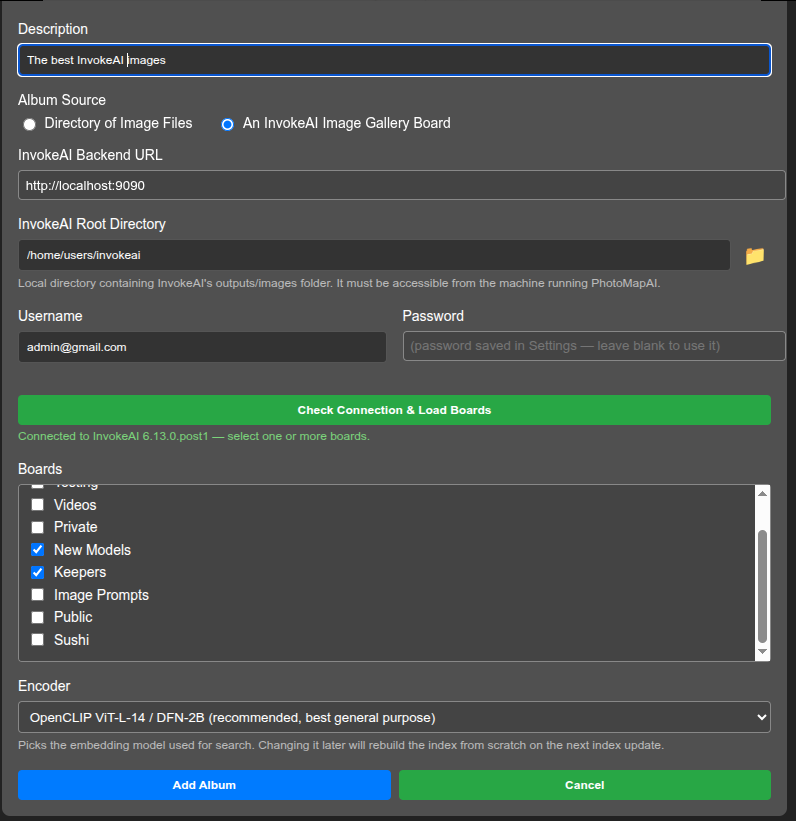
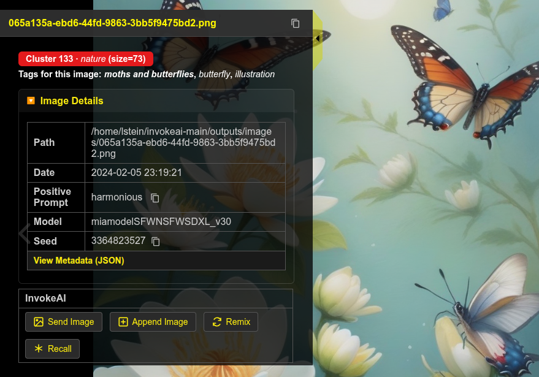

# InvokeAI Integration

PhotoMapAI works well as a browser for AI images generated by
[InvokeAI](https://invoke-ai.github.io/InvokeAI/), the popular
open-source generative-image application. When browsing a directory
containing InvokeAI images, PhotoMapAI gives you easy access to the
image's generation parameters, including the prompt, model and other
parameters. You can also connect PhotoMapAI to a running InvokeAI
backend to enable PhotoMapAI to send images back into InvokeAI for
further work.

## Background

InvokeAI is a free, locally-hosted text-to-image generator built
around Stable Diffusion and related models. You can download it from
the [InvokeAI project
page](https://github.com/invoke-ai/InvokeAI). PhotoMapAI does not
require InvokeAI to be installed — every feature described elsewhere
in the User Guide works on any folder of images — but if you do
generate images with InvokeAI, the integration described here lets you
index, search, and remix that gallery from the same interface.

## Configuring PhotoMapAI to Connect to InvokeAI

If a PhotoMapAI album's directory contains images generated by
InvokeAI, the app will automatically retrieve and display the images'
generation parameters, such as the prompt and model, in the metadata
display drawer. No further configuration is needed for this.

For tighter integration, you can configuration PhotoMapAI with the URL
for a running InvokeAI backend. This will allow PhotoMapAI to create
albums directly from InvokeAI image galleries, to regenerate and remix
previously-generated InvokeAI images, and to send images to InvokeAI
to use as reference images for IP Adapters, ControlNets, and image
editing models.

To configure PhotoMapAI to do this:

1. Make sure InvokeAI is running and note the URL it reports on startup (by default `http://localhost:9090`).
2. In PhotoMapAI, open **Settings** and scroll to the **InvokeAI Backend URL** field.
3. Enter the full URL — including the `http://` or `https://` prefix and the port.

PhotoMapAI saves the value as you type and immediately probes the
backend. If the URL is reachable and looks like InvokeAI, the
**InvokeAI Username**, **InvokeAI Password**, and **Upload to Image
Board** rows appear underneath. If the field underneath the URL turns
red with a warning icon, see [Troubleshooting](#troubleshooting) for
what each message means.

If your InvokeAI server is running in **multi-user mode**, fill in the
**InvokeAI Username** and **InvokeAI Password** fields with the
credentials you use to log in to InvokeAI itself. The password is
stored in PhotoMapAI's user-config directory and is never echoed back
to the browser. For single-user installs (the default) leave both
fields blank.

Once a valid InvokeAI URL is entered, the **Upload to Image Board**
dropdown menu will appear listing the InvokeAI image gallery boards
you have access to. When you select an image to upload into InvokeAI
to use as a reference image, it will be uploaded into the Assets
section of this board.

## Creating an Album that Mirrors InvokeAI Board(s)

Once an InvokeAI backend is defined, you can create an album that
mirrors one or more of Invoke's image boards. Select
**Settings**->**Manage Albums**->**Add Album** and fill in the album
key, display name and description as usual.

Next change **Album Source** to *An InvokeAI Image Gallery
Board*. This will display new fields for the **InvokeAI Backend URL**,
**Root Directory** and **Username/Password**.  The URL, username and
password will all default to the values you used in the settings
dialogue, but you can change them here in the event that you wish to
apply a different backend or user account to this album.

The InvokeAI **Root Directory**, where it stores its generated images,
cannot be retrieved automatically. Type it in, or use the folder browser (folder icon
button) to find it and enter it here. The root directory is typically
`C:\Users\<you>\invokeai` on Windows systems, and
`~/invokeai` on MacOS and Linux systems. If you are unsure you have
selected the right root folder, check its contents for an
`invokeai.yaml` file and folders named `models` and `outputs` directory.

!!! note
    The PhotoMapAI server needs to be able to reach both the InvokeAI
    backend and read from the root directory. If you are running
    InvokeAI with its default `localhost` URL, this means that
    PhotoMapAI has to be running on the same machine. For more
    complex configurations see [PhotoMapAI and InvokeAI on
    different machines](#photomapai-and-invokeai-on-different-machines)

Now click **Check Connection & Load Boards**. This will attempt to
connect to the InvokeAI backend, and if successful will bring up a
list of the image boards the backend makes available. Select the
one or more boards you wish to index.

Click the blue **Add Album** button to complete configuring the album
and beginning the index operation.

You can now use the album just like any other. Only images that are
present on the select board(s) will be displayed, and deleting an
image within PhotoMapAI will trigger a deletion event in InvokeAI so
that the gallery and albumm remain in sync.

!!! warning
    PhotoMapAI does not automatically watch the InvokeAI gallery for new
	or deleted files. Whenever you have generated a batch of images you want to
	browse or search, return to the Album Manager, select the album, and
	press the blue Update Index
	button. Only new and removed files are processed, so the update is
	much faster than the initial indexing pass.
	
At any time, you can **Edit** the album and change which boards will
be indexed.

### Alternative 1: Indexing the Entire InvokeAI Root

An alternative to the above recipe is to create a standard
directory-based album and point it to the `images` folder inside an
InvokeAI root directory, for example
`C:\Users\<you>\invokeai\outputs]\images`. This will index
**everything** inside the directory, including uploaded files and
intermediate images such as raster layers generated by the canvas.

In addition to potentially including undesirable intermediates, the
main disadvantage of this method is that if you delete an image within
PhotoMapAI, this event won't be communicated to InvokeAI, and it will
show a blank or broken image in the gallery.

### Alternative 2: Indexing a Downloaded InvokeAI Board 

Another way of indexing an InvokeAI board is to download its images to
a standalone directory that you then add to an album:

1. Open InvokeAI in a browser.
2. Right click on a board you wish to add to PhotoMapAI.
3. Select "Download Board" to download the images as a zip file.
4. Unpack the zip file in a folder that PhotoMapAI has access to.
5. Create/add this folder to the PhotoMapAI album of your choice.

This recipe is most suited for an image board that doesn't change
frequently. Whtn the board changes, you'll have to repeat the download
and indexing operation to pick up the changes.

### Viewing InvokeAI Metadata

When an InvokeAI-generated image is selected in the PhotoMap browser,
a summary of its metadata will appear in the metadata drawer (see
below).  The drawer will show key generation parameters, including the
date generated, the positive and negative prompts, the AI model used,
the seed, the init image, and any LoRAs or reference images attached
to the generation. Most fields have an icon next to them that lets you
copy their values into the system clipboard.

Click on "View Metadata" to see the full metadata with all generation
parameters listed.

---

## Send, Append, Remix and Recall

When an InvokeAI backend is configured, up to four new buttons appear
in an **InvokeAI** section at the bottom of the metadata drawer:
**Send Image**, **Append Image**, **Remix** and **Recall**. Which ones
are available depends on the image that is currently selected.

### Send Image and Append Image

Any image — generated by InvokeAI or not — can be sent to InvokeAI as
a **reference image**. PhotoMapAI uploads the image bytes to your
InvokeAI gallery (in the board you selected above) so you can
immediately use it in a Reference Image / IP-Adapter / ControlNet
layer. These are the only buttons that appear for non-InvokeAI images,
since there is no generation metadata to recall.

The **Send Image** button sends the current image to InvokeAI,
replacing any reference image that was currently set in the generation
parameters. In contrast, the **Append Image** button adds the current
image to the end of the existing list of reference images, leaving any
images already there in place.

If the image you have selected is one that InvokeAI has never seen, it
will automatically be uploaded as an asset image to the board selected
in the PhotoMapAI configuration dialogue. If you are working with an
image that was generated by InvokeAI and is still in one of its
galleries, then the image will be reused.

!!! note
    PhotoMapAI probes the InvokeAI backend to find out which of these
    operations it supports, and hides the buttons it cannot honour.
    **Send Image**, **Remix** and **Recall** require InvokeAI 6.13.0
    or later; **Append Image** requires InvokeAI 6.13.5 or later. If a
    button you expect is missing, upgrade InvokeAI.

By default, the selected image is used as a reference image for an
image edit model or as an IP Adapter reference image. If you wish to
use it in the InvokeAI Canvas as a raster image or controlnet, go into
the InvokeAI user interface, right click on the image where it appears
in the generation panel, and select **New Canvas from Image**->**As
Raster Layer** or **As Control Layer**.

### Remix and Recall

If the current image contains InvokeAI metadata, two new buttons will
appear:

For images that contain InvokeAI generation metadata, **Remix** sends
every parameter — the prompt, model, LoRAs, scheduler, dimensions,
reference layers, and so on — back to InvokeAI, but **omits the
seed**. Pressing *Invoke* in InvokeAI then produces a new image that
is stylistically similar to the original but unique. Use this when you
want a variation rather than a re-creation.

**Recall** is identical to Remix except that the **seed is
preserved**. With the same model, LoRAs, prompts, and seed, InvokeAI
will reproduce the original image bit-for-bit (assuming the underlying
model files have not changed). This is useful when you want to start
from a known image and edit one parameter at a time.

## Troubleshooting

If something goes wrong while saving the InvokeAI URL or probing the backend, the hint underneath the URL field turns red and shows one of the following messages:

- **InvokeAI URL must use http:// or https://** — the URL you typed uses an unsupported scheme. PhotoMapAI rejects anything other than `http` and `https` (for example, `file://` is not allowed).
- **InvokeAI URL must include a host** — the URL is syntactically valid but has no host portion. Add a host name or IP address (for example `http://localhost:9090`).
- **Could not reach backend** — the URL is well-formed but PhotoMapAI could not connect to the server. Check that InvokeAI is running, that the port matches, and (for remote servers) that no firewall is blocking the connection.
- **Server is reachable but doesn't appear to be an InvokeAI backend** — PhotoMapAI got an HTTP response but it was not what InvokeAI's `/api/v1/app/version` endpoint returns. Double-check the URL and port; you may have pointed PhotoMapAI at a different service running on the same machine.

A few situations are not surfaced inline and are worth knowing about:

- **Boards dropdown is empty or stuck on *Uncategorized*** — usually means authentication failed silently. If your InvokeAI is in multi-user mode, fill in the username and password and re-enter the URL to retrigger the probe.
- **Recall / Remix succeeds but no image queues in InvokeAI** — switch to InvokeAI's browser tab. The recalled parameters land in the canvas/generation panel; you still have to press *Invoke* to start the queue.
- **Remix / Recall buttons missing for an InvokeAI-generated image** — the image was probably produced by an InvokeAI version PhotoMapAI does not yet recognise (only **Send Image** and **Append Image** are shown in that case). Check the *View Metadata (JSON)* link at the bottom of the drawer to confirm the metadata is present, and please [open an issue](https://github.com/lstein/PhotoMapAI/issues) so we can add support for the new schema.
- **Append Image button missing** — the configured InvokeAI backend predates the append option (it shipped in InvokeAI 6.13.5). Upgrade InvokeAI to enable it.

### PhotoMapAI and InvokeAI on different machines

The integration is designed for a single workstation but works across machines too. The important thing to remember is that **only the PhotoMapAI *server* talks to InvokeAI** — your browser does not need to be able to reach the InvokeAI port. Concretely:

1. Start InvokeAI with a non-loopback bind address (for example `--host 0.0.0.0`) so the PhotoMapAI machine can reach it.
2. In PhotoMapAI's **InvokeAI Backend URL** field, use the LAN address or hostname of the InvokeAI machine, not `localhost` (for example `http://10.0.0.42:9090`).
3. The album path you configured in *Creating an InvokeAI Album* must be readable by the PhotoMapAI server. If InvokeAI's `outputs/images/` lives on the InvokeAI machine, mount it on the PhotoMapAI machine over SMB / NFS / SSHFS and point the album at the mount point.

The **Send Image** and **Append Image** actions upload the image bytes over the wire and work regardless of where the file lives. **Recall** and **Remix** only send metadata, so they also work cross-machine — but the receiving InvokeAI server must have the same models, LoRAs, and embeddings installed for the recalled parameters to produce the expected result.
