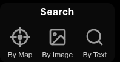
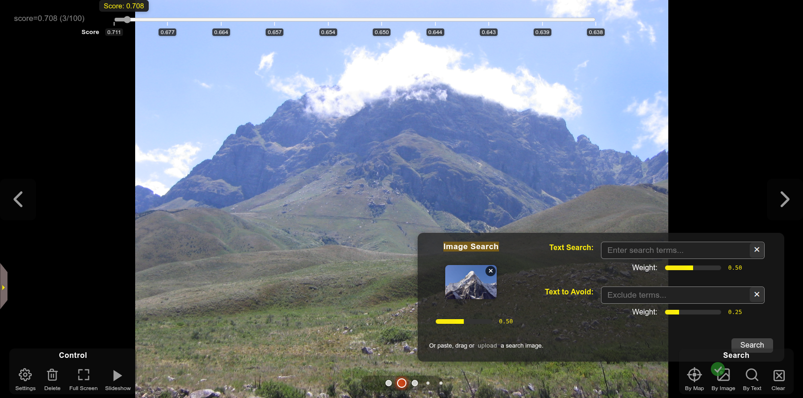
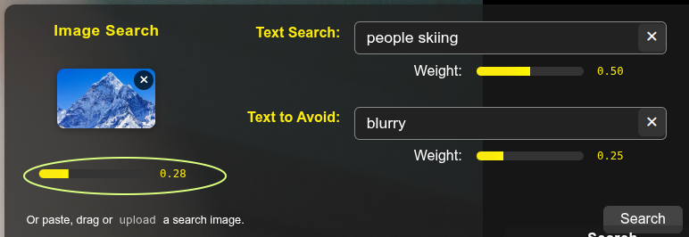
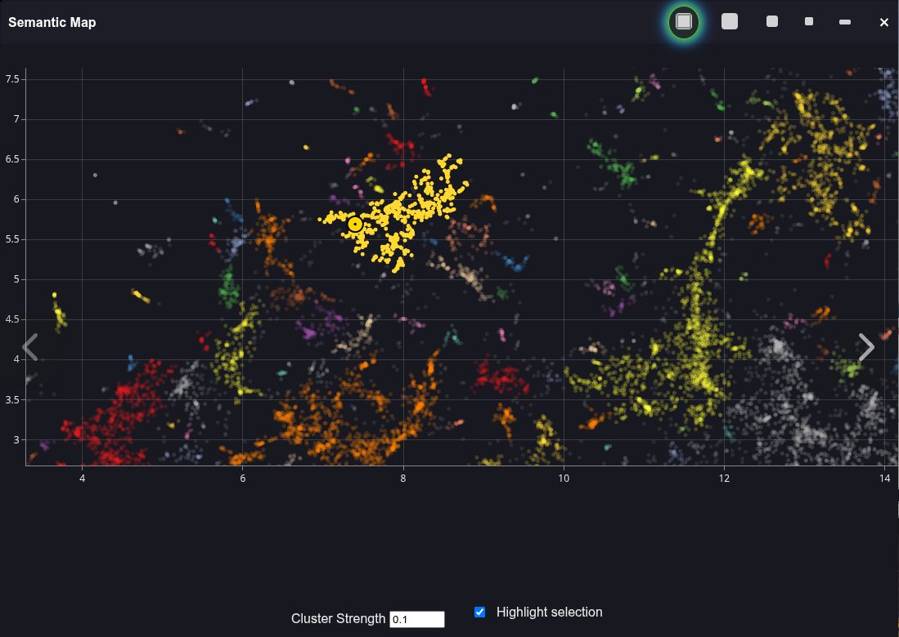

#Search

PhotoMapAI provides several types of AI-enabled search across your image/photo collection:

- **Search by Image** - Provide an image and PhotoMapAI will find matches against it.
- **Search by Text** - Type in a word or phrase and PhotoMapAI will find the closest matches.
- **Search by Text and Image** - Provide image and text to find matches that best combine the two. You can also provide a "negative search text" to disfavor certain image content.
- **Search by Map** - Browse images that are clustered together in the [semantic map](semantic-map.md).

## Search by Image

To search PhotoMapAI by image similarity:

1. Find images similar to the one currently on display in the main window.

    When the image you wish to search on is displayed in the main window, click on the **Landscape** icon (labeled **By Image** in the screenshot above). The search results, sorted in descending order of relevance, will immediately be displayed in the main window. Since you are searching on an image that is already in the album, the top hit will be the one you searched with. Navigate forward using the ***>*** button or the right arrow key to see the next best result.

2. Drag an image into the Search area.

    Drag an image from your local filesystem, a web page, or any other draggable source into the area where the three search buttons are located. The provided image will be used to search for other images that are similar.

3. Upload an image from your local filesystem

    Click on the ***Magnifying Glass*** icon to open up the combined image/text search dialogue. Click the **Image Search** box (see screenshot below) to open up a file picker dialogue.

4. Paste an image from the clipboard

    If you have an image in the clipboard, you may open the search dialogue and paste in the image in using the key combination appropriate for your platform (e.g. command-V).

The screenshot below shows the results of an image search on a photo of a generic mountain found in Google Images. The match score, a value ranging from 0.0 (no match) to 1.0 (perfect match), appears at the top left. The seek slider at the top lets you select images with particular score ranges. A bit counterintuitively, images with the strongest matches (highest scores) appear earlier to the left, and those with the weakest scores appear later.

The exact distribution of scores depends on which [encoder](encoders.md) the album was indexed with. Classic CLIP-style encoders (OpenAI CLIP, OpenCLIP) put strong matches around 0.20–0.40; SigLIP produces calibrated probabilities that put strong matches near 0.5+ but compresses everything else toward zero, so its useful threshold is much lower. The defaults are set per-encoder, but you can override them per album in the search dialog — see [Tuning Search Per-Album](#tuning-search-per-album) below.

## Search by Text

Open the search **By Text** magnifying glass icon and type your search term into the input field labeled "Text Search." A wide variety of search terms are accepted. You can search for people ("blonde man in wool sweater"), subjects ("birthday party"), styles ("graphic novel"), or photography-related descriptors ("out of focus", "motion blur"). You can search for certain celebrities by name, but you *cannot* search for family members, friends and other private individuals. (Providing a way to train PhotoMapAI with custom data is a potential future improvement.)

## Search by a Combination of Text and Image

An advanced use of the search interface allows you to search simultaneously on images and text. You can also provide "negative text" to avoid the appearance of certain themes or subjects. Each of the three search fields is accompanied by a *weight* slider (see circled area in the screenshot below) that controls how much that criterion contributes to the final score. PhotoMapAI computes a similarity score for each modality (image, positive text, negative text) separately, normalizes the text scores so they sit on a comparable scale to image-image similarity, and then takes a weighted average — so the slider values mean what they say: equal weights produce roughly equal contributions.

The negative weight is subtracted from the combined score, so it acts as a penalty rather than diluting the positive contribution. A useful starting point is equal positive-image and positive-text weights with the negative weight set lower; tune from there until the spread of results matches what you expect. Note that negative text alone (no positive query) is not a meaningful search and will return nothing.

## Tuning Search Per-Album

The search dialog has three tuning controls below the prompt area, all stored per-album in the album's configuration. Their values are loaded automatically when you switch albums and persist back to the album's config when you change them.

- **Min. score.** Results below this similarity score are filtered out. Defaults are encoder-aware: 0.2 for CLIP and OpenCLIP albums, 0.005 for SigLIP albums. SigLIP's calibrated probability distribution is much more compressed than CLIP cosines, so its sensible threshold is roughly 40× lower. If you're seeing zero hits where you expect matches, try lowering the threshold first; if you're seeing too many weak matches, raise it.
- **Max. results.** Caps how many top-scoring results are returned. Default is 100. Increase this if you want to see the long tail of borderline matches; decrease it if you only want to see the strongest hits.
- **Query optimization (SigLIP only).** When enabled, SigLIP wraps each text query in five modality-spanning templates (`"a photo of …"`, `"a drawing of …"`, `"an illustration of …"`, `"a painting of …"`, and the bare query), encodes them all, and averages the resulting embeddings. The intent is to make bare-noun queries (like `"woman"`) match more strongly and to avoid systematically penalizing non-photo content (drawings, illustrations) in mixed-media albums. Effects vary by album — for some it improves recall on short queries; for others it lowers per-image cosines just enough to push everything below the SigLIP calibration cliff. Try both settings on your library; the toggle is greyed out for non-SigLIP albums where it has no effect.

## Search by Map

Clicking on the ⊙ (target) icon will open the [Semantic Map](semantic-map.md) and position a yellow marker on the dot that corresponds to the current image in view:

If you hover over dots adjacent to the current one, PhotoMapAI will pop up a thumbnail image to show you the neighbors of the current image. Clicking on a colored cluster will select all members of the cluster, dim other clusters, and set the selected cluster's members as the current search results. To turn off the cluster highlighting and restore full brightness to all clusters, uncheck the **Highlight selection** checkbox in the bottom right-hand corner.

## Clearing the Search

When a search is active, a green checkmark on top of one or more search icons indicates the search type, and a clear search **X Icon** appears in the row of search icons. Click this box to clear the search results and reset PhotoMapAI to album browsing mode. Alternatively you can individually clear the similarity search image, and the positive and negative text search fields, by clicking on the **X** marks in their respective fields of the combined image and text search dialogue.

  
  

