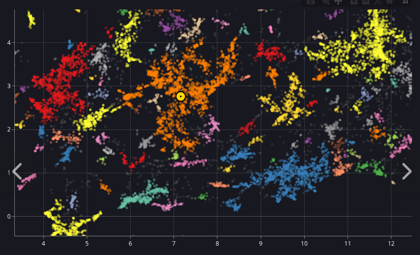
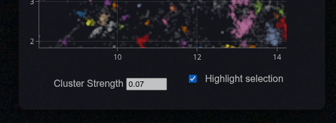
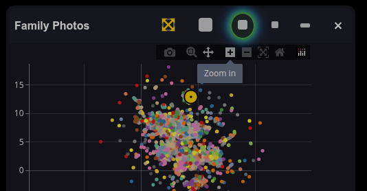
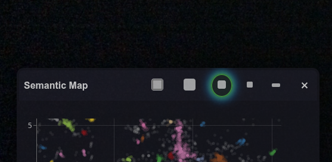
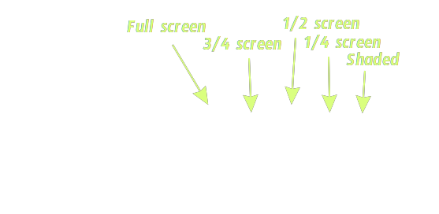
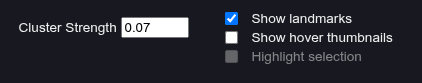
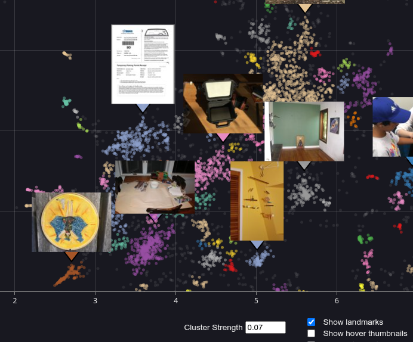
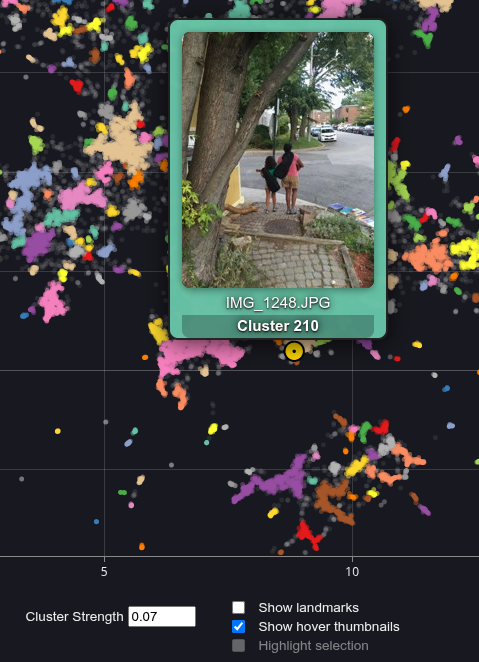

#Semantic Map

The PhotoMapAI semantic map is a graphical representation of the relationships among all the photos/images in an album. Each image is represented by a dot. Images that are similar will be closer together on the map than dissimilar images. The semantic map is linked to the main image display. The location of the current image is shown on the semantic map as a yellow target icon. Clicking on an image dot anywhere in the map will bring the full-resolution photo/image into view in the main display. Hovering over an image dot will pop up a thumbnail of the image, allowing you to rapidly explore the image landscape.

## The Clustering Process

The semantic map is generated in two phases. In the first phase, which is performed when the album's index is created or updated, each image is compressed into a high-dimensional representation of its contents called an "embedding." The embeddings are then projected onto a 2D X-Y plot using the [UMAP dimensionality-reduction algorithm](https://umap-learn.readthedocs.io/en/latest/how_umap_works.html). UMAP is able to preserve the topological relationships among embeddings. Two embedding points that are close together on the UMAP are more semantically similar than two that are far apart.

In the second phase, PhotoMapAI applies an algorithm known as DBSCAN [Density-Based Spatial Clustering of Applications with Noise](https://en.wikipedia.org/wiki/DBSCAN) to partition the map into multiple clusters of highly-related images. Each cluster is then assigned an arbitrary color for visualization. The clustering process is quick and happens automatically the first time you open the semantic map window on a particular album.

### Tuning Clusters

The overall topology of the semantic map is fixed during the indexing process, but the clustering phase can be adjusted on the fly. At the bottom of the semantic map window is a field labeled "Cluster Strength," containing a floating point value. This parameter (technically called epsilon, or "eps") controls the clustering size. Higher values of eps will create a smaller number of large clusters, while lower values will create a larger number of small clusters.

Until you set a value yourself, PhotoMapAI chooses one for the album and marks it **auto** beside the field. There is no single number that suits every collection: the map's coordinates have no fixed scale, and the same eps that carves a library of tens of thousands of photos into useful clusters can leave a few hundred photos entirely unclustered. The chosen value is derived from how tightly that album's own images sit together, taking the most generous clustering that does not merge the map into one giant cluster.

Typing in the field replaces the derived value with yours, the **auto** marker disappears, and the album keeps your number from then on. If the eps is too low, you will see a lot of unclustered images, represented as faint gray dots; if it is too high, the map collapses toward a single color. Adjust the "Cluster Strength" field until the display is satisfactory.

!!! tip "Clear the field to get a value chosen for you"

    Deleting everything in the "Cluster Strength" box — leaving it empty — hands the album back to PhotoMapAI, which picks a reasonable value from that album's own map and marks it **auto**. Nothing is lost by trying it: if you prefer your own number, type it back in.

    This is worth doing on albums you created before this feature existed. Those albums all carry a saved Cluster Strength, so they will not show the **auto** marker until you clear the field once, even though the value they carry may be one nobody chose deliberately. Small albums are where it matters most: a number that clusters tens of thousands of photos nicely can leave a few hundred photos completely unclustered.

### Interpreting Clusters

What does "semantically similar" mean? Embeddings capture many different aspects of an image, ranging from low-level features such as brightness and color palette, to high-level features such as particular people and places. This can lead to interesting appositions. For example, say you have three photos depicting (1) Mary at the playground; (2) Mary at a birthday party; and (3) Timmy at a birthday party. (1) and (2) will mapped close together because they share the same subject, Mary. (2) and (3) will be close together because they share the same event, a birthday party. Because of these relationships, (1) and (3) will also likely be close together as well, but further apart than either of the other two pairs.

Therefore you will find clusters that contain a mixture of relationships. Sometimes you will find yourself scratching your head to figure out why several images cluster together, but more often you'll discover delightfully unexpected groupings. For example, my family photo collection contains clusters corresponding to "kids climbing trees," "pets yawning," and "weddings on the maternal side of the family."

---

## Navigating the Map

When you first open the map it will be zoomed almost all the way out. You will likely wish to increase the zoom level in order to see more detail. This is intuitive when using a mouse. The scrollwheel will zoom in and out, while clicking and dragging on the map will move the map around (panning). 

There is also a hidden navigation bar at the top of the plot that appears when you hover the mouse pointer over it. From left to right, the icons have the following functions:

- **Camera Icon** - Snapshot the current map and save it to disk as a PNG image.
- **Magnifier Icon** - Outline a rectangular region of the map and zoom into it.
- **NSEW Arrows Icon** - Pan the image (default behavior).
- **+ and - icons** - Zoom in and zoom out.
- **Crossed Arrows Icon** - Zoom out until the entire map is in view.
- **Home Icon** - Reset view to the default.
- **Plotly Icon** - Advertisement for the plotting package used to plot the map.

On tablet devices, the best way to zoom into an area of interest is to use the magnifier icon and/or a combination of the pan tool and the Zoom in/out icons.

---

## Moving and Resizing the Map Window

The map window can be repositioned anywhere on the screen by clicking and dragging on its titlebar. It can be resized by clicking the resize icons shown in the screenshot below (mouse over to see the legend).

  
  

The sizes shown are approximate and are adjusted for different size browser windows. The full-screen size (the leftmost icon) covers the entire window and is opaque. Other sizes are slightly transparent to allow you to see the full-size images beneath.

The shade icon (rightmost) collapses the window so that only the titlebar is visible. This is convenient for temporarily uncluttering the screen.

## Controlling Thumbnail Images

The semantic map can show you preview images in two ways. You can have it pop up thumbnails on the fly as you mouse over the map. You can have it put down static thumbnail landmarks on the most prominent clusters in the current view. Or you can do both!

These functions are controlled by the checkboxes in the bottom right of the window:

Selecting "Show landmarks" will position small static thumbnails on the clusters, while "Show hover thumbnails" will pop up a larger preview window as you hover the mouse over the image dots. The former gives you an overview of what's in your collection. The latter gives you only one preview image at a time, but it is larger and more detailed.

With "Show landmarks" turned on and "Show hover thumbnails" turned off:

With "Show hover thumbnails" turned on and "Show landmarks" turned off:

## Showing images, videos, or both

If the album contains videos as well as photos, the **Show** radio buttons choose
which of them the map draws: **Both**, **Images only**, or **Videos only**.
Videos are placed by the same semantic embedding as photos — computed from a
still captured shortly after the video starts — so a clip lands next to the
pictures it looks like.

Filtering changes only what the map displays. Cluster identity is unaffected,
so a cluster keeps its colour and its members whichever setting you pick;
selecting a cluster while a filter is active loads only the media types
currently shown. The controls are disabled for albums that contain no videos.

By default, landmarks will be turned on and hover images turned off when you enter the map's fullscreen mode. The opposite happens when  you leave fullscreen mode and enter windowed mode. See below for more information on window modes and sizes.

---

## Selecting Clusters

Clicking on any colored image dot or a landmark preview will select all the images in its cluster and add them to the main display's search results. You will see the selected cluster become brighter, while all the other clusters will dim. This effect can be turned on and off by clicking on the checkbox in the bottom right corner labeld "Highlight selection."

When a cluster is selected, the image search results will be sorted according to their distance from the image you clicked on in the semantic map. If you leave the semantic map window open and scroll through the results, you will see the yellow map position marker move increasingly far away from the original point. At the same time, the displayed full-size images will slowly diverge and become more diverse.

### Unclustered Images

There will often be images that can't be assigned to any cluster. These appear as light gray dots in scatterplot. Click on one of these to highlight the unclustered images and browse through them.

You can decrease the number of unclustered images by increasing EPS. This will cluster the images more aggressively and also merge existing clusters. Experiment until you find the setting that works best for you — the derived starting point aims for a balance between the two, so both raising and lowering it are useful.