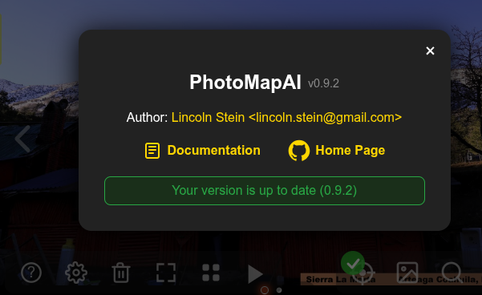
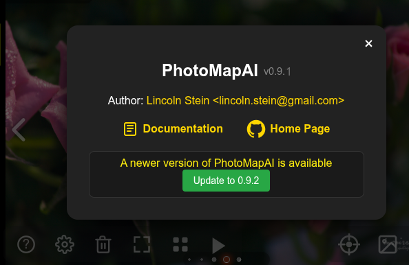

#Upgrading

There are several ways to upgrade an installed version of PhotoMapAI to the latest and greatest version:

1. Using [online updating](#updating-online) from the application itself.
2. On the [command line](#updating-on-the-command-line), using the Python package installer, pip.
3. [Via docker](#via-docker)
4. [By reinstalling](#via-a-reinstall)

##How to find the current version

From within the web application, click on the "?" icon at the bottom left of the screen. This will bring up an about box window within information about the application, including the current version number. If you are running the most current release, there will also be a green box confirming that you are up to date. 



##Updating online

If the currently installed version of PhotoMapAI is out of date, you will be offered the option of upgrading online. Click the green button in the about box window to begin the update process.



This will download the latest version, install it, restart the backend, and finally reload the web front end. It should be a relatively quick process taking less than a minute. If the install is interrupted for some reason, the browser window may never reload. In this case, go to the window in which the backend is running, interrupt it with the ^C key if it is running, and relaunch the server.

---

##Updating on the command line

If you are comfortable with installing python packages using `pip`, you can easily upgrade from the command line. Follow these steps:

###1. **Activate the PhotoMapAI virtual environment.** 

Locate the PhotoMapAI install directory, and run this command:

*Linux/Macintosh*
```bash
source <path_to_photomap>/bin/activate
```
*Windows*
```bash
<path_to_photomap>\Scripts\activate
```
Depending on permissions, Windows users may need to use the Command shell and run `activate.bat` instead of `activate`. When the virtual environment is active, the command prompt will change to `(photomap)`.

###2. **Run PIP --upgrade** 

Next issue this command:

```bash
pip install photomapai --upgrade
```

###3. **Restart the server** 

Interrupt the currently running server with ^C and relaunch it.

###4. **Reload the browser window** 

And you're done!

---

##Via docker

New docker images are generated for each release. To get the latest version, simply kill the currently running version and docker run `lstein/photomapai:latest`:

```bash
docker run -p 5080:5080 lstein/photomapai:latest
```

---

## Via a reinstall

Finally, you can simply reinstall the whole package from the GitHub zip file, as described in [Installation](../installation.md). Because its configuration and index files are kept separately, you can reinstall on top of the existing PhotoMapAI directory, or even delete this directory and start over again.


